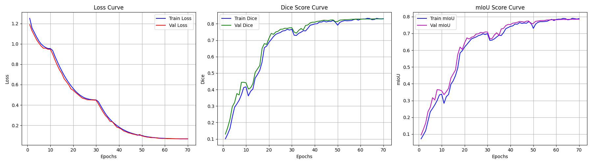

# Swin-UNet for Synapse Multi-Organ Segmentation


This repository contains a PyTorch implementation of **Swin-UNet** (Swin Transformer-based U-Net) for multi-organ segmentation using the **Synapse** dataset. The model leverages the hierarchical Swin Transformer as the backbone to capture long-range dependencies, achieving superior performance in medical image segmentation tasks.

---
### 🌟 Key Features
- **Swin Transformer Backbone**: Replaces standard CNNs with a pure Transformer-based encoder for better global context.
- **U-Shaped Architecture**: Skip connections between encoder and decoder to preserve spatial details.
- **Synapse Dataset Support**: specifically designed for 9-class abdominal organ segmentation.
- **3D Volume Inference**: Includes slice-by-slice inference with 3D reconstruction evaluation.
- **Comprehensive Logging**: Tracks Dice, mIoU, and Loss with CSV logging and scientific notation for low learning rates.

---
### 🔬 Experimental Context: From ADE20K to Synapse

##### Why switch back to Medical Imaging?
During the initial phase of this project, experiments were conducted using the **ADE20K** dataset (Scene Parsing, 150 classes). The goal was to test Swin-UNet's capability on complex natural scenes.

However, several challenges were observed:
1.  **High Complexity**: ADE20K contains 150 diverse classes with high variability in scale and occlusion, making it significantly harder to converge compared to medical datasets.
2.  **Resource Constraints**: To achieve competitive results on ADE20K, Swin-UNet typically requires larger input resolutions (e.g., 512x512 or higher) and extensive pre-training on ImageNet-22k, which significantly increased computational costs.
3.  **Model Suitability**: Preliminary results showed that while the model captured global context well, the segmentation accuracy (mIoU) on small objects was suboptimal.

**Conclusion**:
Given these findings, the project focus was shifted back to **Synapse Multi-Organ Segmentation**. This domain leverages Swin-UNet's strength in capturing long-range dependencies for fixed anatomical structures, providing a more effective demonstration of the architecture's potential in high-precision tasks.




---
## 📂 Project Structure

```text
├── data/                       # Dataset directory
│   └── synapse/
│       ├── train_npz/          # Training slices (.npz)
│       └── test_vol_h5/        # Testing volumes (.h5)
├── models/
│   └── swinunet.py             # Swin-UNet model definition
├── utils/
│   ├── dataset.py              # Custom Dataset class
│   ├── logger.py               # CSV Logger
│   ├── loss.py                 # Segmentation Loss (CrossEntropy + Dice)
│   ├── metrics.py              # Dice and mIoU calculation
│   └── plot.py                 # Training history visualization
├── config.py                   # Configuration parameters
├── train.py                    # Training script
├── predict_synapse.py          # Inference and 3D evaluation script
└── README.md
```

---
### 🧠 Dataset Details

The project uses the **Synapse Multi-Organ CT Dataset**.

- **Classes (9 total)**: 0. Background
    
    1. Aorta
    2. Gallbladder
    3. Kidney (Left)
    4. Kidney (Right)
    5. Liver
    6. Pancreas
    7. Spleen
    8. Stomach

---
### 🛠️ Installation

1. **Clone the repository**
```
git clone https://github.com/Jacky-0202/SwinUNet-Seg.git
cd swin-unet-synapse
```
    
2. **Install dependencies** 
	It is recommended to use a virtual environment (Conda or venv) to avoid conflicts.
    
```bash
pip install -r requirements.txt
```

---
### 🚀 Usage

##### 1. Training

To start training the Swin-UNet model from scratch (or pretrained weights).
The training logs will be saved to results/.

```bash
python train.py
```

- **Configuration**: You can adjust `BATCH_SIZE`, `LR`, `EPOCHS`, and paths in `config.py`.
- **Logging**: Check `results/training_log.csv` for real-time metrics.

##### 2. Inference (Testing)

To evaluate the model on 3D test volumes (`.h5` files) and generate visualization.

```bash
python predict_synapse.py
```

- This script performs slice-by-slice inference, reconstructs the 3D volume, and calculates the **3D Dice Score** for each organ.
- Visualization results (Ground Truth vs. Prediction) will be saved in `test_results_volume/`.

---
### 🤝 Reference

If you find this project useful, please refer to the original Swin-UNet paper:

- **Swin-UNet: Unet-like Pure Transformer for Medical Image Segmentation**
    
    - _H. Cao, Y. Wang, J. Chen, D. Jiang, X. Zhang, Q. Tian, M. Wang_
    - [arXiv:2105.05537](https://arxiv.org/abs/2105.05537)
